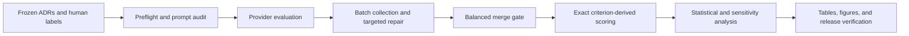

# Can LLMs Check Your Architecture Decisions?

This repository is the replication package for an evaluation of large language
models on Architecture Decision Record (ADR) compliance review. It contains the
frozen evaluation set, human reference assessments, retained criterion-level
model responses, exact scoring code, statistical analyses, and publication
figures.

## Publication Configuration

| Item | Frozen value |
| --- | --- |
| Protocol | `v31-fulltext-criterion-derived-1` |
| Model-response run | `v31_fulltext_gpt_medium` |
| Canonical analysis run | `v31_fulltext_gpt_medium_exact_scoring` |
| ADRs | 162 from 14 licensed GitHub repositories |
| Models | GPT-5.5, Claude Sonnet 4.6, hosted Ministral 3 8B, Gemini 2.5 Pro |
| Prompt conditions | Zero-shot, few-shot, chain-of-thought |
| Repetitions | 3 per model and prompt configuration |
| Retained evaluations | 5,832 |
| Input policy | Complete ADR text in every request |
| GPT reasoning effort | `medium` |
| Scoring | `exact-rational-v1`; rounding is for display only |
| Model access date | 2026-09-08 |
| Pricing verification date | 2026-09-10 |

The model-response run contains the responses returned by the four providers.
The canonical analysis run was produced later by applying exact rational
arithmetic to the retained C1-C7 and Q1-Q7 values. It made no API calls and did
not alter model criteria, prompts, human labels, or the evaluation sample.
Forty of 5,832 derived overall predictions changed at exact score boundaries.

Two `loopdive/js2` records contained em or en dash bytes that the original
Windows run decoded through Windows-1252. They were complete but displayed
misdecoded punctuation. `release/input_text_exceptions.json` records their
stored-text and model-input hashes. The loader now reproduces that transform
explicitly on every operating system. The analysis also reports a 160-ADR
exclusion check for these two records.

## Quick Verification

Python 3.12 is recommended. From the repository root:

```powershell
python -m venv .venv
.\.venv\Scripts\Activate.ps1
python -m pip install -r requirements.txt
python -B scripts\verify_release.py
python -B -m unittest discover -s tests -v
```

The first command after installation is read-only. It checks release metadata,
frozen input hashes, sample composition, human-review counts, all 12 balanced
model and prompt configurations, full-text input use, exact classifications,
and required analysis artifacts. See [REPRODUCIBILITY.md](docs/REPRODUCIBILITY.md)
for offline analysis, figure regeneration, API smoke testing, and a complete
paid rerun.

## Experiment Lifecycle



The reported experiment begins from the checked-in frozen inputs. Historical
corpus acquisition and preliminary annotation are not required to verify or
replicate the reported model evaluation. Every phase writes into the selected
run directory. A bare `python adr_benchmark.py` invocation prints help and does
not start paid or corpus-changing work.

## Repository Map

```text
adr_benchmark.py                         experiment and analysis runner
adr_scoring.py                           exact shared scoring rules
requirements.txt                        pinned replication environment
environment/reference_environment.json  captured reference environment
release/release_spec.json                frozen release expectations
scripts/verify_release.py                read-only package audit
scripts/build_release.py                 allowlisted release builder
scripts/verify_validation_run.py         reduced-run completeness audit
scripts/generate_publication_assets.py   tables and figures from saved analysis
tests/                                   unit and protocol tests
results/eval_set.json                    frozen 162-ADR manifest
results/human_ground_truth.json          primary human assessments
results/human_ground_truth_interrator.json  second human assessments for 41 ADRs
results/adrs/                             frozen source documents
results/runs/v31_fulltext_gpt_medium/     original full-text model-response run
results/runs/v31_fulltext_gpt_medium_exact_scoring/  canonical analysis
```

Manuscript drafts, temporary renderings, dependency caches, credentials, and
local development outputs are not part of the reviewer release.

The retained historical details that require careful interpretation are listed
in [PROTOCOL_NOTES.md](docs/PROTOCOL_NOTES.md). Reviewer concerns and their
repository evidence are mapped in
[REVIEWER_FEEDBACK_TRACEABILITY.md](docs/REVIEWER_FEEDBACK_TRACEABILITY.md).
The publication-facing directory layout is described in
[REPOSITORY_STRUCTURE.md](docs/REPOSITORY_STRUCTURE.md).

## Dataset and Human Assessment

The fixed evaluation set has the following recorded reference distribution:

| Overall class | ADRs | Percent |
| --- | ---: | ---: |
| Fully Compliant | 63 | 38.9% |
| Mostly Compliant | 53 | 32.7% |
| Partially Compliant | 33 | 20.4% |
| Not Compliant | 13 | 8.0% |

Seven software and IT industry experts with at least eight years of experience
provided the primary assessments using the frozen C1-C7 and Q1-Q7 rubric. A
separate second human assessment covers 41 evaluation ADRs. The recorded
overall labels match the primary labels for 37 of 41 ADRs. When both reviewers'
overall classes are recomputed from their submitted criterion values, 27 of 41
match. Eleven recorded overall labels in the second-assessment file differ from
the class implied by that file's own criterion values. The package preserves
both forms of evidence and does not silently reconcile them.

Generated public releases pseudonymize reviewer identities. The published
codes preserve reviewer-assignment structure without disclosing personal
names.

The retained files do not independently document reviewer assignment,
blinding, or adjudication. This README therefore does not claim those procedural
properties. GPT-4o prelabels were workflow aids and are not used as the reference
labels for model evaluation.

## Rubric and Classification

Structural Completeness uses seven binary criteria:

| ID | Criterion |
| --- | --- |
| C1 | Descriptive title |
| C2 | Context or problem statement |
| C3 | Decision drivers |
| C4 | At least two considered options |
| C5 | Decision outcome with justification |
| C6 | Positive and negative consequences |
| C7 | Valid status |

Decision Quality uses seven ordinal criteria scored from 0 to 3:

| ID | Criterion |
| --- | --- |
| Q1 | Problem relevance |
| Q2 | Option viability |
| Q3 | Criteria completeness |
| Q4 | Criteria prioritization |
| Q5 | Rationale soundness |
| Q6 | Consequence objectivity |
| Q7 | Actionability |

SC and DQ are weighted scores from 0 to 100. The composite score is
`0.40 * SC + 0.60 * DQ`. The ordered overall rule is:

1. Not Compliant when the composite score is below 45 or SC is below 40.
2. Fully Compliant when the composite score is at least 85, SC is at least 80,
   and DQ is at least 80.
3. Mostly Compliant when the composite score is at least 70, SC is at least 60,
   and DQ is at least 60.
4. Partially Compliant otherwise.

All threshold comparisons use exact rational arithmetic. Numeric values are
rounded only when displayed in tables or prose.

## Model Conditions

| Paper label | Exact model ID | Access | Maximum output | Reasoning or decoding setting |
| --- | --- | --- | --- | --- |
| GPT-5.5 | `gpt-5.5-2026-04-23` | OpenAI hosted API | 8,192 completion tokens | `reasoning_effort=medium` |
| Claude Sonnet 4.6 | `claude-sonnet-4-6` | Anthropic hosted API | 4,096 tokens | Provider default; no thinking parameter sent |
| Ministral 3 8B | `ministral-8b-2512` | Mistral hosted API | 2,048 tokens | Temperature 0 |
| Gemini 2.5 Pro | `gemini-2.5-pro` | Google hosted API | 8,192 output tokens | Provider default; no thinking parameter sent |

Provider settings were held constant across prompt conditions within each
model. They are documented as tested configurations and are not presented as
equivalent internal compute. The optional local Mistral 7B path retained in the
runner is a historical, non-publication condition and is excluded from the
reported benchmark and reviewer rerun instructions.

## Results and Provenance

Use files under
`results/runs/v31_fulltext_gpt_medium_exact_scoring/analysis/` for reported
statistics. In particular:

| Artifact | Purpose |
| --- | --- |
| `exact_rescoring_report.json` | Every changed boundary classification and source hash |
| `exact_scoring_verification.json` | Independent integer-oracle verification |
| `performance_details.json` | Per-repetition and per-class performance |
| `pairwise_statistical_tests.json` | ADR-level paired inference |
| `criterion_level_performance.json` | C1-C7, Q1-Q7, SC, and DQ performance |
| `rubric_sensitivity_performance.json` | Six alternative rubric analyses |
| `rule_hybrid_comparison.json` | Rule-only, LLM-only, and hybrid results |
| `cost_analysis.json` | Dated token and cost accounting |
| `manuscript_assets/` | Publication tables, figures, and input hashes |

The original provider run remains under
`results/runs/v31_fulltext_gpt_medium/`. This separation makes the scoring
correction auditable and prevents the corrected analysis directory from being
used for new model calls.

## Live API Runs

Live smoke tests and complete reruns incur provider costs. Copy `.env.example`
to `.env`, enter credentials locally, and use a new run ID. Never place a live
run in the canonical analysis directory.

```powershell
python adr_benchmark.py --phase smoke --run-id reviewer_smoke_YYYYMMDD --gpt-reasoning-effort medium
```

The smoke phase makes one request for each requested model and prompt condition
and writes only to its new run directory. It does not change reported results.
The complete provider workflow is documented in
[REPRODUCIBILITY.md](docs/REPRODUCIBILITY.md).

For an inexpensive end-to-end functional check, use `--validation-size 5` with
a new run ID. The runner derives a deterministic class-covered subset from the
frozen evaluation manifest and stores it inside that run. Validation results
are marked `publication_compatible=false` and cannot be confused with the
reported 162-ADR experiment. Exact commands are provided in the reproducibility
guide.

## Immutable Release

`scripts/build_release.py` creates an allowlisted package and writes a manifest
containing the source commit, run IDs, protocol and scorer versions, file sizes,
and SHA-256 hashes. By default it refuses to build from a dirty Git worktree.
After the package is verified, create an immutable GitHub tag and release, then
archive that release with Zenodo. Record the issued tag, DOI, and access date in
the manuscript Data Availability statement. Do not cite the mutable `master`
branch as the study artifact.

See [RELEASE_CHECKLIST.md](docs/RELEASE_CHECKLIST.md) for the final publication
sequence.

## License

Benchmark code is released under the MIT License. ADR texts are third-party
materials and remain governed by their source repositories' licenses and
copyright. See [THIRD_PARTY_NOTICES.md](THIRD_PARTY_NOTICES.md) and the
machine-readable `release/source_licenses.json` inventory before reusing ADR
text outside research replication.
